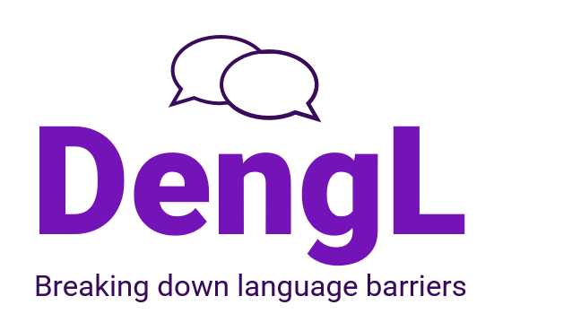
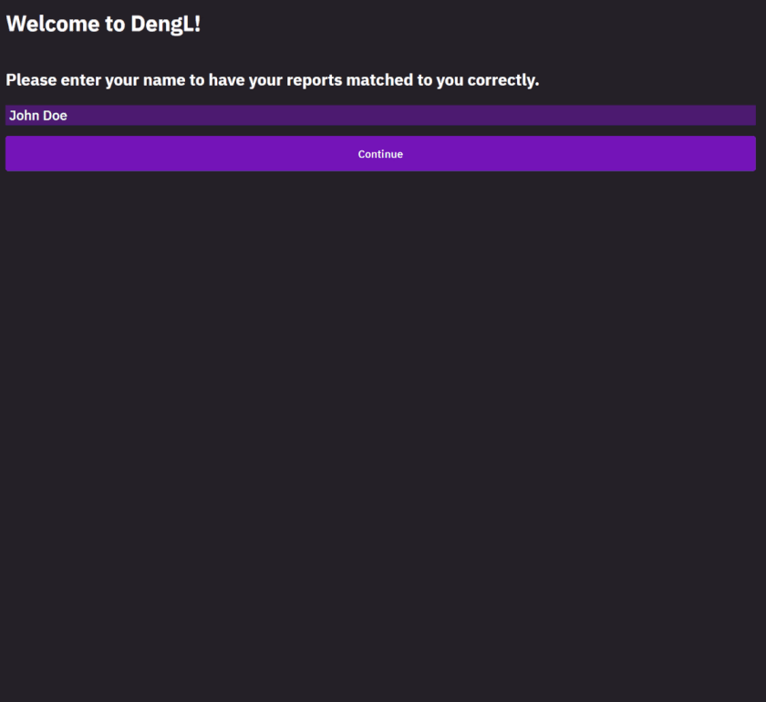

Report generation tool with code-mixed translation using neural machine learning model

# DengL – Breaking down language barriers

## Challenge

The challenge is set by the company Knowron during the TUM.ai Makeathon 2023.

Make integration into the job market easier for immigrant workers by allowing them to document their work without speaking the native
language of the country.

The idea is to create more opportunities and break down the language barrier in the job market.

Create an efficient and effective process for report creation that incorporates notes and voice memos using NLP to enable talents worldwide to collaborate.

No hallucinations should be present.

## Usage

The service that was developed during the Makeathon can be used for free at a privately hosted [Website](https://whai.yousuckatprogramming.de/#/intro).

## Installation

Next to cloning this repository it is also necessary to install one of the latest releases of [_wkhtmltopdf_](https://github.com/wkhtmltopdf/packaging/releases) for automatic pdf generation.

## Todo

Train a custom translator with a code-mixed, business domain corpus dataset: 
- When a sentence contains a mixture of languages, the sentence is detected in the language with the highest percentage. When trying to translate the sentence into the detected language, the translator outputs the original sentence with the other languages intact (untranslated). This is because the translator thinks the sentence has already been translated. A new model or language detection algorithm is needed to avoid this problem.

- Mixing languages with fewer speakers leads to more frequent errors, especially when languages with different word order are mixed.

## Authors

[Lukas Mahr](https://github.com/Plutokekz)

[You Sun Song](https://github.com/ysunnn)

[Felix Bastian](https://github.com/Muhlex)

[Felix Waiblinger](https://github.com/FelixWaiblinger)

For support, feel free to reach out to whai@yousuckatprogramming.de
